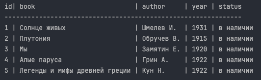

**CMD Library Manager** — это консольная программа для учета книг, 
которая позволяет добавлять, удалять и изменять статус книг, 
а также осуществлять поиск по названиям книг, авторам или годам издания. 
Все данные хранятся в JSON-файле.

## Основные функции

- **Учет книг**: Добавление, удаление и изменение статуса книг (в наличии/выдана).
- **Поиск**: Поиск книг по названию, автору или году издания с выводом результатов в виде таблицы.
- **Вывод всех книг**: Возможность вывести список всех книг из базы данных.

## Установка

Для установки программы выполните следующие шаги:

1. Клонируйте репозиторий с GitHub:
   ```
    git clone https://github.com/MyLord916/cmd_library_manager.git
   ```
2. Перейдите в каталог проекта:
    ```
   cd cmd_library_manager
    ```
3. Запустите программу:

   ```
   python3 main.py
   ```
   
## Использование

Программа поддерживает следующие команды:


**Добавление книги** :


```
add Title/Author/2024
```


Добавляет книгу в список с присвоением ей ID и статуса "в наличии".


**Изменение статуса книги** :


```
stat 1 0
```


Изменяет статус книги с ID 1 на "выдана" (0 - "в наличии").


**Вывод всех книг** :


```
all
```


Выводит таблицу со всеми книгами из базы.


**Удаление книги** :
```
del 1
```

Удаляет книгу с ID 1 из базы.


**Поиск книг** : 

Введите фразы через пробел без предварительной команды для поиска по базе данных.
Результаты будут выведены в таблицу в случае совпадения.




## Требования

Программа написана на Python 3.12 и не требует установки дополнительных библиотек